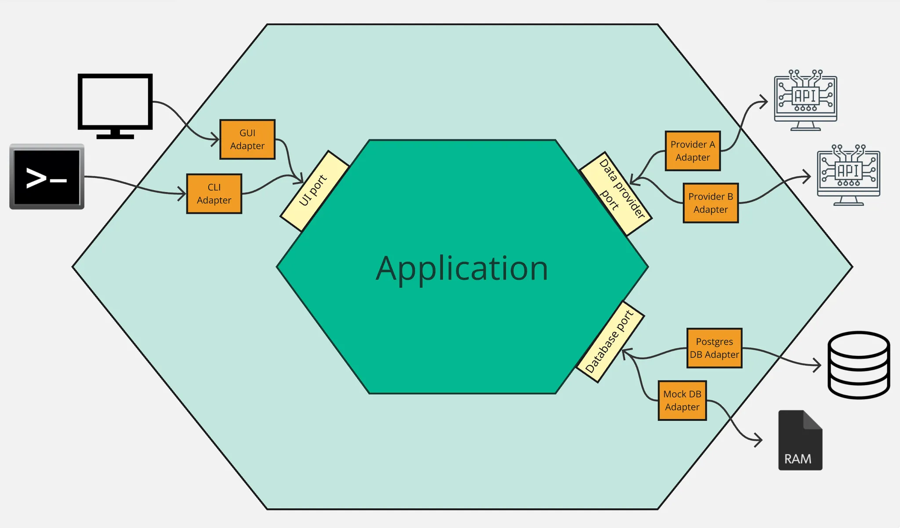

One of the most common pitfalls when integrating external systems is allowing their implementation details to leak into your domain.

I am going to tell you about how I used the Ports & Adapters architecture to keep the domain free of the internal details of third-party data providers.

## What is meant by domain?

> The subject area to which the user applies a program is the domain of the software - [Eric Evans](https://www.domainlanguage.com/wp-content/uploads/2016/05/DDD_Reference_2015-03.pdf)

The domain sits at the core of a software system and defines and encodes the business rules you care about. It’s the code you have full control over. The logic you invested time in understanding and refining and (hopefully) helped make your customers lives better. An algorithm that helps schedule your users’ daily activities is part of your domain. The data provider you started pulling data from is not part of your domain as you have no control over how their API works or the data they send you.

## Why it’s important to separate external dependencies from the domain

In my experience, infiltration of the details of an external dependency into the domain has caused a number of problems, which I will detail further below.

The code examples are simplified and adapted for illustrative purposes and intentionally hide the details of a specific production system.

### Third-party is reflected in the implementation

In the specific example I want to explore, we were pulling data from a single third-party and representing that data in our UI. The entire raw data object received from the third-party was passed in to the Django template that generated the HTML for the UI. The template was overwhelmed with code that referenced complex paths within the data that were determined by the provider.

Our implementation was bending to accommodate the third-party, rather than the other way around. If the shape of the data was ever to change, there was a high chance the code would error and there would be no way of knowing until a user accessed the page.

In addition to this, the name of the provider was littered throughout the codebase. Models, views, templates, forms and serializers all referenced the name of the provider. Even the publicly facing urls contained the provider name! We were taking the lazy option of using their name rather than focussing on more meaningful domain language.

### Bloated tests

In our code, the retrieval and storing of the data was entirely contained within the API view and was tightly-coupled to the third-party. Any time we wanted to test basic internal logic related to generating and storing a report we had to understand the inner workings of the external API and mock those accordingly. Mocking methods were inconsistent, adding to the complexity of what should have been very basic tests.

```python
class ReportTests:
    def test_stores_report_when_country_iso_code_and_resource_id_provided(client, httpx_mock):
        httpx_mock.add_response(
		        url="https://provider_one.com/authenticate",
		        json={"token": "dummy_token"},
		    )
		    httpx_mock.add_response(
		        url="https://provider_one.com/resource/123",
		        json={"name": "Hello World"},
		    )

        response = client.post("/generate_report/", {
            "country_iso_code": "GB",
            "resource_id": "123",
        })

				report = Report.objects.first()
        assert report.name == "Hello World"

		def test_returns_400_when_country_iso_code_not_provided(client):
        with requests_mock.Mocker() as m:
            m.post(
                "https://provider_one.com/authenticate",
                json={"token": "dummy_token"},
            )
            m.get(
                "https://provider_one.com/resource/123",
                json={"name": "Hello World"},
            )

            response = client.post("/generate_report/", {
                "resource_id": "123",
            })

        assert response.status_code == 400
```

These tests end up verifying that we have mocked the provider correctly when all they should be concerned with is our internal business logic.

### Difficult to implement a new provider

At one point, we needed to implement a new data provider in order to improve the quality of the data we presented back to our users. We had to dynamically select which provider to use based on some pre-defined conditions. It was almost impossible to re-use the existing code without increasing its complexity by scattering conditional logic throughout.

What we needed was a way to isolate our domain from these concerns entirely.

Enter Ports & Adapters.

## Ports & Adapters



The Ports & Adapters architecture (originally named Hexagonal architecture) was introduced by Alistair Cockburn in a 2005 [article](https://alistair.cockburn.us/hexagonal-architecture). Cockburn describes an architecture where the application (or domain) sits in the centre with a strict boundary between it and any outside concerns. The application can send or receive signals via ports to an adapter which translates the signal necessary for/from the outside technology. He cites GUIs, databases and third-party services as examples of outside concerns.

In the same article, Cockburn states the primary intent of the architecture:

> Allow an application to equally be driven by users, programs, automated test or batch scripts, and to be developed and tested in isolation from its eventual run-time devices and databases.

## How we implemented Ports & Adapters

### Define an outbound port

The first step for us was to define the port which would act as a contract for how our application would communicate with external data providers. We implemented this as an abstract class in Python, analogous to an interface.

```python
from abc import ABC, abstractmethod

class ReportProvider(ABC):
    @abstractmethod
    def generate_report(
        self,
        country_iso_code: str,
        resource_id: str,
    ) -> dict:
        pass
```

Python ABCs (Abstract Base Classes) don’t exactly equate to interfaces in strongly-typed languages such as Java or C# and some would argue that Python’s duck-typing makes this class unnecessary. In our case, I valued the fact that creating this forced us to think at an early stage about how our domain would communicate with the outside world and considered the overhead to be worth it.

### Define an adapter for the existing provider

Next we created an adapter that respected this contract and defined the provider-specific implementation to retrieve the necessary data.

```python
class ProviderOneAdapter(ReportProvider):
    def generate_report(
        self,
        country_iso_code: str,
        resource_id: str,
    ) -> dict:
        try:
            data = ProviderOneAPI().report(
		            country_iso_code,
                resource_id,
            )
        except ProviderOneRequestError:
		        _logger.info("Error fetching data from ProviderOne")
            raise
        return data
```

```python
class ProviderOneAPI:
    # code omitted for brevity

    @async_to_sync
    async def report(self, country_iso_code: str, resource_id: str) -> dict:
        if country_iso_code == "GB":
            return await self.get(
                f"/resource/{resource_id}?gb_specific_args"
            )
        elif country_iso_code == "US":
            return await self.get(f"/resource/{resource_id}?us_specific_args")

        return await self.get(f"/resource/{resource_id}")
```

This gave us a clean, reusable interface for generating a company report with the existing provider. Now we needed a suitable place to call this from.

### Application service

We wanted to create a reusable single-entry point for generating a company report that did not need to concern itself with the internal details of how we are communicating with the outside world.

```python
class ReportService:
    def generate_report(
		    self,
			  country_iso_code: str,
			  resource_id: str
		) -> dict:
				provider = ProviderOneAdapter()
        data = provider.generate_report(
            country_iso_code,
            resource_id,
        )

        report = Report.objects.create(resource_id=resource_id, data=data)

        return report
```

### Call the service

The action to initiate the generation of a company report was via an API request sent from our UI. We were able to implement a very thin view that delegated to the application service.

```python
class CompanyReportViewSet:
    @action(detail=False, methods=["post"])
    def generate_report(self, request):
        report = ReportService().generate_report(
		        country_iso_code=request.data.get("country_iso_code"),
            resource_id=request.data.get("resource_id")
				)

        return Response(status=200, data=report)
```

We now had parity with the existing behaviour and were able to ship these changes without our customers knowing that the implementation had changed.

We had set ourselves up nicely for the next task of implementing the new provider.

### Repeat for new provider

We needed to create an adapter for the new provider which respected the same contract we had defined in the outbound port.

```python
class ProviderTwoAdapter(ReportProvider):
    def generate_report(
        self,
        country_iso_code: str,
        resource_id: str,
    ) -> dict:
		    api = ProviderTwoAPI()
        report_data = api.report(resource_id)
        other_data = api.other_data(resource_id)

        # code omitted for brevity
```

```python
class ProviderTwoAPI:
    # code omitted for brevity

    @async_to_sync
    async def report(self, resource_id: str):
        return await self.get(
            f"/data/{resource_id}"
        )

    @async_to_sync
    async def other_data(self, resource_id: str | None = None) -> dict:
        return await self.get(
            f"/other_data/{resource_id}"
        )
```

Notice that the implementation for generating a report is different for the new provider as we need to make 2 API calls. The great thing about our new architecture was that we could easily implement this in isolation from the original provider and the service does not need to know that the implementation differs between the two.

Now we could implement the logic for deciding which provider to use with minimal code change. We created a factory to act as a composition point, keeping this logic centralised in one place.

```python
class ReportProviderFactory:
    PROVIDER_MAP = {
        "GB": ProviderOneAdapter,
    }

    DEFAULT_PROVIDER = ProviderTwoAdapter

    @classmethod
    def get_provider(cls, country_iso_code: str):
        provider_class = cls.PROVIDER_MAP.get(
            country_iso_code,
            cls.DEFAULT_PROVIDER
        )
        return provider_class()

class ReportService:
		def __init__(self, provider_factory=ReportProviderFactory):
        self.provider_factory = provider_factory

    def generate_report(
		    self,
			  country_iso_code: str,
			  resource_id: str
		) -> dict:
        provider = self.provider_factory.get_provider(country_iso_code)
        data = provider.generate_report(
            country_iso_code,
            resource_id,
        )

        report = Report.objects.create(resource_id=resource_id, data=data)

        return report
```

We were then able to keep the view almost as it was, simply adding some validation logic within a serializer to ensure that we handled any missing required arguments.

```python
class GenerateReportSerializer(serializers.Serializer):
    country_iso_code = serializers.CharField(required=True)
    resource_id = serializers.CharField(required=True)

class CompanyReportViewSet:
    @action(detail=False, methods=["post"])
    def generate_report(self, request):
        serializer = GenerateReportSerializer(data=request.data)
        serializer.is_valid(raise_exception=True)

        service = ReportService()
        report = service.generate_report(
		        country_iso_code=serializer.validated_data["country_iso_code"],
            resource_id=serializer.validated_data["resource_id"],
        )

        return Response(status=200, data=report)
```

### Improved testing strategy

One of the biggest benefits of separating external dependencies from our domain was the impact it had on our testing approach.

By introducing a clear boundary around external dependencies, we were able to rethink how we test each layer of the system.

#### Unit tests: fast and focused

At the lowest level, we were able to test our application logic in complete isolation by providing a stub implementation of our provider.

```python
class StubProvider:
    def generate_report(self, country_iso_code, resource_id):
        return {"name": "Hello World"}

class StubFactory:
    def get_provider(self, country_iso_code):
        return StubProvider()

def test_stores_report_when_valid_country_code_and_resource_id_provided():
    service = ReportService(provider_factory=StubFactory())

    service.generate_report("GB", "123")

    report = Report.objects.first()
    assert report.data.get("name") == "Hello World"
```

These tests are fast, deterministic, and completely independent of external systems

Most importantly, they focus purely on our business logic, not the mechanics of external APIs.

#### View tests: thin and expressive

At the API layer, we only care about request validation and response structure. We can mock the service and avoid pulling in any lower-level concerns.

```python
def test_returns_report_when_valid_payload_provided(api_client):
    stub_report = {
        "resource_id": "123",
        "report": {"name": "Hello World"},
    }

    with patch(
        "path.to.ReportService.generate_report",
        return_value=stub_report
    ):
        response = api_client.post(
            "/generate_report/",
            {
                "country_iso_code": "GB",
                "resource_id": "123",
            },
            format="json"
        )

    assert response.status_code == 200
    assert response.json() == stub_report
```

Notice how we are no longer mocking HTTP calls, URLs, or provider-specific behaviour. The test now depends on a single, stable interface: `ReportService.generate_report`. This means that any changes to the external providers API do not affect the view specific tests and we avoid duplicating provider setup.

Validation tests become even simpler, requiring no mocking at all:

```python
def test_returns_400_when_country_iso_code_missing(api_client):
    response = api_client.post(
        "/generate_report/",
        {
            "resource_id": "123",
        },
        format="json"
    )

    assert response.status_code == 400
```

#### Integration tests: test adapters in isolation

Where we do need confidence in external integrations, we can test adapters directly and in isolation. These tests can use tools like `httpx_mock`, but are now limited to a small, well-defined surface area.

This keeps the complexity contained, rather than leaking into every test in the system.

## Did this solve our problems?

In short, yes. We had pushed the provider specific implementation out of our domain and introduced naming that reflected the domain concepts and operations.

We were now able to test our internal logic free from the overhead of having to mock calls to the external services.

Once we had the architecture in place we were able to add a new provider with little code changes in our domain logic. We knew that we had future-proofed ourselves if the requirement arose to add yet another provider.

More importantly, it allowed us to evolve our system without fear of breaking unrelated parts of the codebase.

## Closing thoughts

There are a multitude of ways we could have tackled this, each with their own pros and cons. I like to apply pragmatism when making these choices rather than advocating for a one size fits all solution. We chose Ports & Adapters as it promised to solve the particular issues we were facing and is a well established architectural pattern with lots of examples to follow.

Using this pattern served us well at the time and has gone on to be replicated in other parts of our codebase with equal success.
